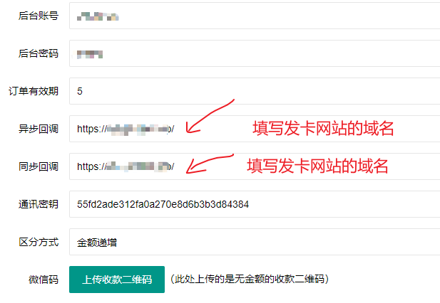
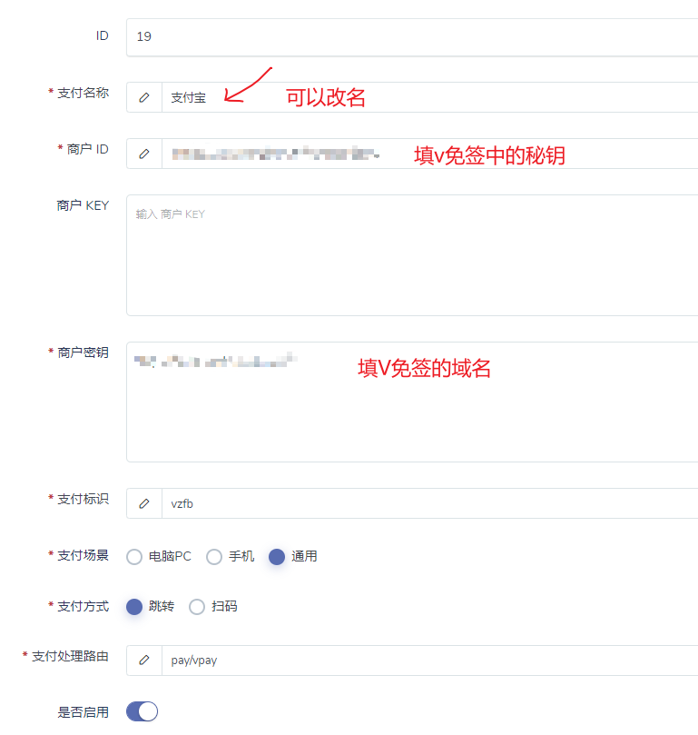
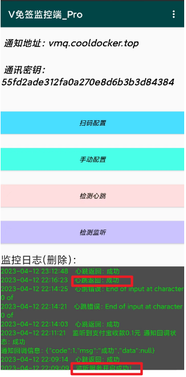

# 独角兽发卡系统对接V免签

# 0、整个支付回调过程

客户----》你的独角兽发卡网站下单-----》跳转到V免签支付页面进行支付----》手机或PC支付监控APP收到支付信息-----》监控APP会把支付信息发送给V免签后台-----》V免签把支付成功信息回调给独角兽发卡网站---》发卡网站自动发卡

所以回调地址填写发卡网站。整个过程是由发卡系统 到 V免签支付系统 再回到发卡系统。

# 1、独角兽系统搭建注意事项

- 注意在网站搭建好了之后，再申请SSL，并启动强制https
- 改配置后，保存，出现500错误，应该先关闭ngnix防火墙中对应的站点
- 开启SSL后，后台登录出现0err。应该再根目录下.env文件加配置 ADMIN_HTTPS=true

# 2、V免签搭建注意事项

- 由于源码比较老，php版本不要用7.4。7.2是ok的。
- 其他的对照github官网说明文档安装

## 2.1 V免签后台配置注意事项

异步回调 ： 这里是填写发卡网站的域名，不要写v免签的域名。如果开启了https。就填写https://发卡网站域名/

同步回调：这里也填的发卡网站的域名。

## 2.2 独角兽支付插件配置

分别配置v免签-支付宝和v免签-微信

支付名称：可以自定义或者不改

商户ID：填V免签中的通信秘钥

商户KEY：不填

商户秘钥：填V免签的域名。如果开启了https。就填写https://你的V免签域名/

支付场景：填写通用

# 3、支付监控APP

有些太老旧的手机无法监听。可以换个手机试试

正常启动后。监控日志要有 “监听服务开启成功！”

扫码配置后，点击检测心跳，要返回“成功”。

这两个满足才说明OK。

启动后点击检测监听没反应，是正常的，不用管。

若手机开启了VPN代理，请把代理模式设置为规则模式，不要让监控APP走VPN代理。否则会出现心跳错误。

如果不开启VPN。每10秒回自动发心跳。到凌晨还不断的发心跳，容易导致海外服务器的IP被墙。所以此方案不是很完美。

海外服务器开启CDN，就不会导致ip被封，但是访问速度会变慢，且不稳定。会导致回调跳转变慢。也不太完美。